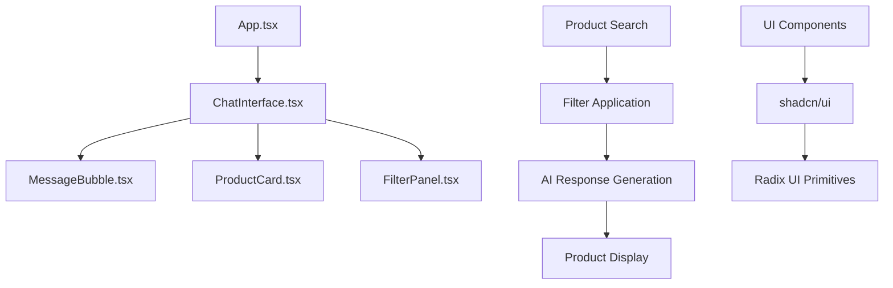

# 🛒 Shopping Assistant AI

An intelligent, conversational shopping assistant built with React and TypeScript. This application provides a modern chat interface where users can search for products, apply filters, and get personalized recommendations through natural language interactions.


## ✨ Features

### 🤖 Intelligent Chat Interface
- **Natural Language Processing**: Interact with the AI using everyday language
- **Real-time Responses**: Instant product recommendations and search results
- **Typing Indicators**: Visual feedback during AI response generation
- **Message History**: Persistent chat history within the session
- **Conversation Reset**: Easy reset functionality to start fresh

### 🔍 Advanced Product Search
- **Smart Search Algorithm**: Searches across product names, descriptions, and categories
- **Filter Integration**: Search results respect active filters
- **Multi-Category Support**: Electronics, Accessories, Clothing, Home & Garden
- **Stock Awareness**: Indicates product availability in real-time

### 🎛️ Comprehensive Filtering System
- **Category Filtering**: Filter by specific product categories
- **Price Range**: Set minimum and maximum price boundaries
- **Stock Status**: Show only available items
- **One-Click Reset**: Clear all filters instantly
- **Collapsible Panel**: Space-efficient filter interface

### 🎨 Modern UI/UX Design
- **Gradient Backgrounds**: Beautiful blue-to-purple gradients throughout
- **Glass Morphism**: Backdrop blur effects for modern aesthetics
- **Responsive Grid**: Adaptive product cards for all screen sizes
- **Micro-Animations**: Smooth hover effects and transitions
- **Accessibility**: ARIA labels and keyboard navigation support

## 🚀 Quick Start

### Prerequisites
- Node.js 16+ and npm
- Modern web browser

### Installation

1. **Clone the repository**
   ```bash
   git clone <your-repo-url>
   cd shopping-assistant
   ```

2. **Install dependencies**
   ```bash
   npm install
   ```

3. **Start development server**
   ```bash
   npm run dev
   ```

4. **Open your browser**
   Navigate to `http://localhost:8080`

### Available Scripts

| Command | Description |
|---------|-------------|
| `npm run dev` | Start development server with hot reload |
| `npm run build` | Build production bundle |
| `npm run build:dev` | Build development bundle |
| `npm run lint` | Run ESLint for code quality |
| `npm run preview` | Preview production build locally |

## 🏗️ Architecture

### Tech Stack

| Technology | Version | Purpose |
|------------|---------|---------|
| **React** | 18.3.1 | UI framework |
| **TypeScript** | 5.5.3 | Type safety |
| **Vite** | 5.4.1 | Build tool & dev server |
| **Tailwind CSS** | 3.4.11 | Styling framework |
| **shadcn/ui** | Latest | UI component library |
| **Radix UI** | Latest | Accessible primitives |
| **Lucide React** | 0.462.0 | Icon library |
| **React Router** | 6.26.2 | Client-side routing |

### Project Structure

```
src/
├── components/
│   ├── ChatInterface.tsx      # Main chat component
│   ├── FilterPanel.tsx        # Product filtering interface
│   ├── MessageBubble.tsx      # Individual chat messages
│   ├── ProductCard.tsx        # Product display cards
│   └── ui/                    # shadcn/ui component library
├── pages/
│   ├── Index.tsx              # Home page
│   └── NotFound.tsx           # 404 error page
├── hooks/
│   ├── use-mobile.tsx         # Mobile detection hook
│   └── use-toast.ts           # Toast notification system
├── lib/
│   └── utils.ts               # Utility functions
└── App.tsx                    # Root application component
```

### Component Architecture



## 🛍️ Product Catalog

The application includes a comprehensive mock product database:

### Categories & Products

| Category | Products | Price Range |
|----------|----------|-------------|
| **Electronics** | Headphones, Smartwatch, Cables, Laptop Stand | $12.99 - $199.99 |
| **Clothing** | T-Shirts, Jeans, Dresses, Shoes, Jackets | $24.99 - $149.99 |
| **Home & Garden** | Plants, Tools, Lamps, Pillows, Wall Art | $34.99 - $119.99 |

### Product Features
- ⭐ **Ratings**: 4.2 - 4.8 star ratings
- 📦 **Stock Status**: Real-time availability
- 🖼️ **Images**: Placeholder images (ready for real product photos)
- 📝 **Descriptions**: Detailed product descriptions

## 🤖 AI Assistant Capabilities

### Conversation Types
- **Greetings**: Friendly welcome and introduction
- **Help Requests**: Detailed assistance and feature explanations
- **Product Searches**: Natural language product discovery
- **Recommendations**: Intelligent product suggestions
- **Error Handling**: Graceful handling of no-results scenarios

### Search Intelligence
```typescript
// Example search capabilities
"wireless headphones" → Electronics category products
"under $50" → Price-filtered results
"summer clothing" → Seasonal clothing items
"home decor" → Home & Garden category
```

## 🎨 Design System

### Color Palette
- **Primary**: Blue to Purple gradients (`from-blue-500 to-purple-600`)
- **Background**: Soft gradient (`from-blue-50 to-purple-50`)
- **Cards**: White with transparency (`bg-white/80`)
- **Text**: Semantic color system with proper contrast

### Typography
- **Headers**: Bold, modern font weights
- **Body**: Clean, readable text with proper line heights
- **Interactive**: Distinct styling for buttons and links

### Components
- **Rounded Corners**: Consistent border radius system
- **Shadows**: Subtle elevation with proper shadow hierarchy
- **Animations**: Smooth transitions and micro-interactions
- **Responsive**: Mobile-first design with breakpoint optimization

## 🔧 Customization

### Adding New Products
```typescript
// In ChatInterface.tsx, extend the mockProducts array
const newProduct: Product = {
  id: 'unique-id',
  name: 'Product Name',
  price: 99.99,
  category: 'Category',
  image: '/path/to/image.jpg',
  rating: 4.5,
  description: 'Product description',
  inStock: true
};
```

### Extending AI Responses
```typescript
// In generateBotResponse function
if (lowerMessage.includes('your-keyword')) {
  return { 
    text: "Custom response text",
    products: filteredProducts 
  };
}
```

### Adding New Categories
1. Update the `categories` array in `FilterPanel.tsx`
2. Add products with the new category to `mockProducts`
3. Update search logic if needed


### Production Deployment
```bash
# Build the project
npm run build

# The `dist` folder contains the production build
# Deploy to your preferred hosting platform (Vercel, Netlify, etc.)
```

### Environment Considerations
- ✅ **Client-side only**: No backend dependencies
- ✅ **Static hosting compatible**: Works with any static hosting service
- ✅ **Mobile responsive**: Optimized for all device sizes
- ⚠️ **No browser storage**: Uses in-memory state only

## 🛣️ Roadmap

### Immediate Improvements
- [ ] **Real API Integration**: Connect to actual e-commerce APIs
- [ ] **Enhanced AI**: Implement advanced NLP with external AI services
- [ ] **User Authentication**: Add user accounts and personalization
- [ ] **Shopping Cart**: Full cart functionality with checkout process
- [ ] **Payment Integration**: Add payment processing capabilities

### Advanced Features
- [ ] **Product Recommendations**: ML-based recommendation engine
- [ ] **Voice Interface**: Voice-to-text search capabilities
- [ ] **Multi-language Support**: Internationalization (i18n)
- [ ] **Analytics Dashboard**: User behavior and sales analytics
- [ ] **Inventory Management**: Real-time stock tracking
- [ ] **Review System**: Customer reviews and ratings

### Technical Enhancements
- [ ] **Performance Optimization**: Code splitting and lazy loading
- [ ] **Offline Support**: Service worker implementation
- [ ] **Push Notifications**: Real-time alerts for deals and updates
- [ ] **Progressive Web App**: PWA capabilities
- [ ] **Testing Suite**: Comprehensive unit and integration tests

## 🤝 Contributing

### Development Guidelines
1. **Code Style**: Follow existing TypeScript and React patterns
2. **UI Components**: Use shadcn/ui components when possible
3. **Styling**: Utilize Tailwind CSS utility classes
4. **Type Safety**: Maintain strict TypeScript typing
5. **Component Architecture**: Keep components focused and reusable

### Contribution Steps
1. Fork the repository
2. Create a feature branch (`git checkout -b feature/amazing-feature`)
3. Commit changes (`git commit -m 'Add amazing feature'`)
4. Push to branch (`git push origin feature/amazing-feature`)
5. Open a Pull Request

## 📄 License

This project is licensed under the MIT License - see the [LICENSE](LICENSE) file for details.

## 🙏 Acknowledgments

- **shadcn/ui**: Beautiful and accessible UI components
- **Radix UI**: Primitive component library
- **Tailwind CSS**: Utility-first CSS framework
- **Lucide**: Beautiful icon library

## 📞 Support

For support and questions:
- 📧 **Email**: [your-email@example.com]
- 🐛 **Issues**: [GitHub Issues](https://github.com/your-username/shopping-assistant/issues)
- 💬 **Discussions**: [GitHub Discussions](https://github.com/your-username/shopping-assistant/discussions)
